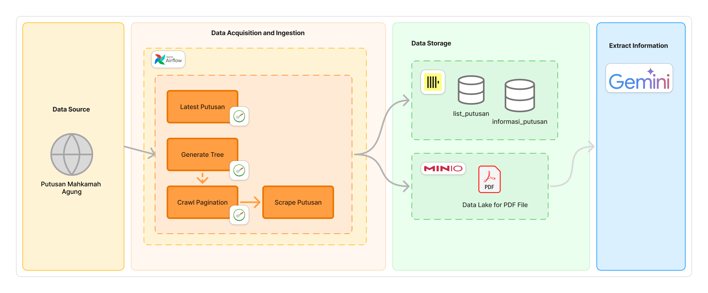

# Putusan Mahkamah Agung Crawler using Scrapy, Apache Airflow, ClickHouse and S3 MinIO

This is a 1+ month internship project that helps telecom companies enrich their user data by scraping Supreme Court decisions (putusan mahkamah agung) and extracting descriptions from them.

## Tech Stack Overview

This project was both challenging and enjoyable to work on.

- **Scrapy**: Handles web crawling and page extraction
- **ClickHouse**: Stores and enables fast querying of crawled data
- **Apache Airflow**: Orchestrates the crawler
- **S3 MinIO**: Data lake for storing PDFs

## Architecture

## Prerequisites
- Python 3.7+
- [Scrapy](https://scrapy.org/)
- [ClickHouse](https://clickhouse.com/)
- [S3 MinIO](https://min.io/)
- [Apache Airflow](https://airflow.apache.org/)

## How to Run

```bash

docker network create airflow-net

docker run -d --name airflow \
  --network airflow-net \
  -p 8080:8080 \
  -v ".:/opt/airflow/project" \
  -v "./airflow/dags:/opt/airflow/project/dags" \
  -v "./airflow/plugins:/opt/airflow/project/plugins" \
  -e AIRFLOW_HOME=/opt/airflow/project \
  -e AIRFLOW__CORE__EXECUTOR=SequentialExecutor \
  apache/airflow:3.0.3-python3.10 \
  bash -c "cd /opt/airflow/project && pip install -r requirements.txt && airflow standalone"
  
docker run -d \
  --network airflow-net \
  --name clickhouse \
  --ulimit nofile=262144:262144 \
  -e CLICKHOUSE_USER=default \
  -e CLICKHOUSE_PASSWORD=default \
  -p 8123:8123 \
  -p 5473:5473 \
  clickhouse/clickhouse-server

docker run -d --name minio \
  --network airflow-net \
  -p 9000:9000 \
  -p 9001:9001 \
  -e "MINIO_ROOT_USER=minioadmin" \
  -e "MINIO_ROOT_PASSWORD=minioadmin" \
  -v "./minio-data:/data" \
  quay.io/minio/minio server /data --console-address ":9001"
```

Or manual (without orchestration)
```
cd crawler && scrapy crawl direktori
cd crawler && scrapy crawl crawl_populate
cd crawler && scrapy crawl scrape_list_putusan
cd crawler && scrapy crawl scrape_page
```